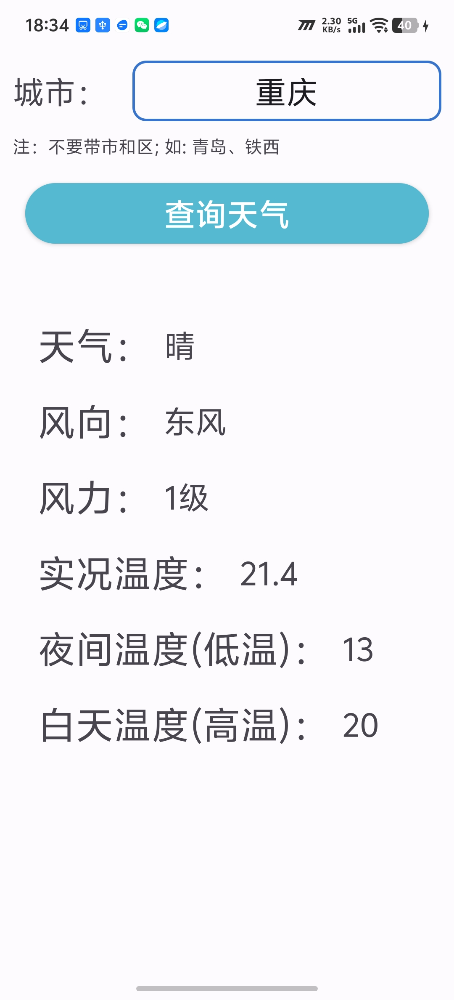
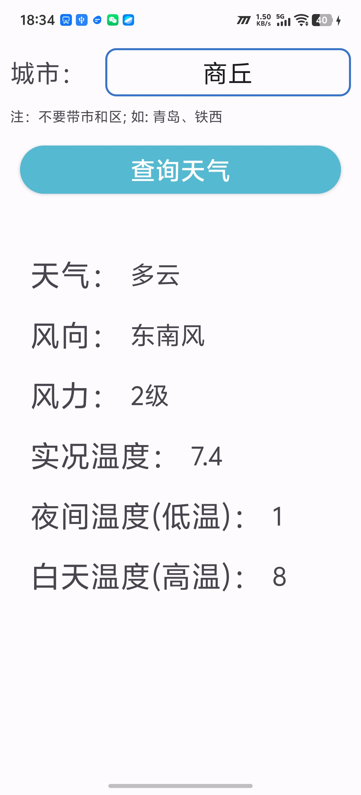
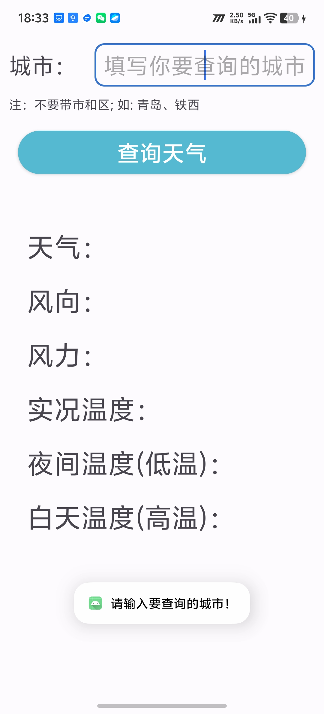

# WeatherApp ☁️
一个基于 Android 平台的天气查询应用，支持实时天气查询、多城市管理等功能。

---

## 项目简介
- **项目名称**：WeatherApp
- **开发环境**：Android Studio + Java
- **最低兼容**：Android 8.0 (API 26)
- **目标版本**：Android 14 (API 34)
- **仓库地址**：https://github.com/qingliu-1/WeatherApp

---

## 核心功能
- 🌤 **实时天气查询**：根据城市名称查询当前温度、湿度、风力等天气信息
- 🏙 **多城市管理**：支持添加、删除、切换不同城市的天气
- 📱 **简洁界面**：采用 Material Design 设计风格，操作直观易用

---

## 技术栈
- **语言**：Java
- **网络请求**：HttpURLConnection + JSON解析
- **UI 框架**：AndroidX + Material Design
- **构建工具**：Gradle

---

## 功能展示

以下是App的核心功能演示：

- 支持输入城市名称查询实时天气
- 显示温度、湿度、风力等详细信息

---

## 开发心得
在开发 WeatherApp 的过程中，我主要有以下几点收获：
1.  **网络请求处理**：学习了如何在 Android 中安全地进行网络请求，避免主线程阻塞。
2.  **UI 适配**：掌握了不同屏幕尺寸下的布局适配技巧，提升了用户体验。
3.  **错误处理**：理解了网络异常、数据解析失败等场景下的容错处理逻辑。

---

## 安装与使用
1.  下载项目代码到本地：`git clone https://github.com/qingliu-1/WeatherApp.git`
2.  使用 Android Studio 打开项目，等待 Gradle 同步完成。
3.  连接 Android 设备或启动模拟器，点击运行按钮即可安装并启动 App。
4.  首次启动后，输入城市名称即可查询对应天气。

---

## 作者信息
- **姓名**：华士豪
- **专业**：大数据管理与应用
- **学号**：2025211442
- **日期**：2026年2月